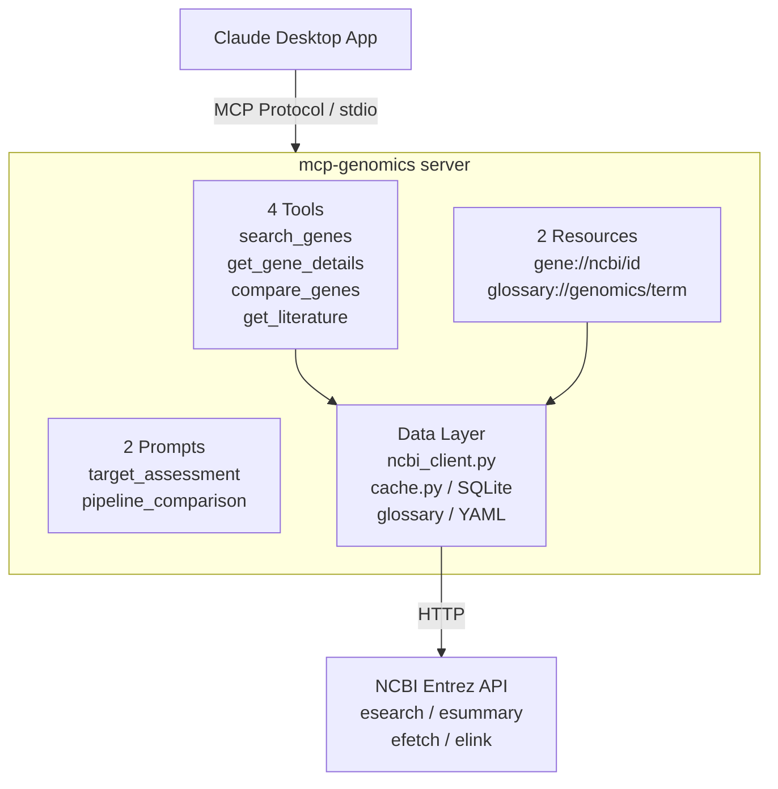

# mcp-genomics 🧬

An MCP server that gives Claude access to genomics intelligence,
built for biotech & pharma enterprise workflows.

---

## The Problem

Drug discovery analysts spend hours manually querying NCBI databases, cross-referencing genes, pulling PubMed publications, and compiling target assessment reports. Each query requires navigating multiple web interfaces, copying data between tools, and formatting results for non-technical stakeholders. This MCP server automates that entire workflow, giving Claude direct access to genomics databases so analysts can get structured, citable research outputs through conversation.

## What It Does

- **Search genes** across NCBI databases by keyword, disease, pathway, or function
- **Pull detailed gene profiles** with disease associations and pathway data
- **Compare candidate therapeutic targets** side by side with overlap analysis
- **Surface recent PubMed evidence** linked to any gene, citable, with URLs
- **Pre-built prompt templates** for target assessment and pipeline comparison workflows
- **Local glossary** of genomics terminology with enterprise context for non-specialist audiences

## Demo

> "Search for genes associated with Alzheimer's disease"

<!-- Paste screenshot here: gene search results in Claude Desktop -->

> "Do a target assessment on BRCA1 in the context of breast cancer"

<!-- Paste screenshot here: full target assessment workflow output -->

> "Compare TP53, BRCA1, and EGFR for our oncology pipeline"

<!-- Paste screenshot here: pipeline comparison with recommendation matrix -->

> **Tip:** To add screenshots, edit this README on github.com and paste/drag images directly into the editor. GitHub hosts them automatically.

## Architecture



## Project Structure

```
mcp-genomics/
├── pyproject.toml
├── src/mcp_genomics/
│   ├── server.py              # MCP server entry point
│   ├── api/
│   │   └── ncbi_client.py    # Async NCBI Entrez client
│   ├── data/
│   │   └── cache.py          # SQLite cache (7d gene, 1d literature)
│   ├── tools/
│   │   ├── search_genes.py
│   │   ├── gene_details.py
│   │   ├── compare_genes.py
│   │   └── literature.py
│   ├── resources/
│   │   ├── gene_resource.py
│   │   └── glossary_resource.py
│   └── prompts/
│       └── templates.py
├── data/glossary/
│   └── genomics.yaml          # 19 terms with enterprise context
└── tests/
    ├── conftest.py
    ├── test_*.py              # 25 tests
    └── fixtures/              # Real NCBI API responses
```

## Quick Start

### 1. Clone & install

```bash
git clone https://github.com/your-username/mcp-genomics.git
cd mcp-genomics
uv sync --extra dev
```

Or with pip:

```bash
python -m venv .venv
.venv\Scripts\activate        # Windows
pip install -e ".[dev]"
```

### 2. Configure Claude Desktop

Add to your Claude Desktop config (`%APPDATA%\Claude\claude_desktop_config.json` on Windows):

```json
{
  "mcpServers": {
    "mcp-genomics": {
      "command": "C:/path/to/your/.venv/Scripts/python.exe",
      "args": ["-m", "mcp_genomics"],
      "env": {
        "NCBI_EMAIL": "your.email@example.com"
      }
    }
  }
}
```

> **Note:** Use the full path to your venv's `python.exe`. Claude Desktop doesn't inherit your shell PATH.

### 3. Restart Claude Desktop

The server appears in the MCP tools menu (hammer icon).

## Environment Variables

| Variable | Required | Description |
| --- | --- | --- |
| `NCBI_EMAIL` | Recommended | Email sent with API requests. NCBI uses this to contact you if your usage causes problems. Not enforced, but expected. |
| `NCBI_API_KEY` | Optional | Raises the rate limit from 3 requests/second to 10. Get one free at [NCBI Settings](https://www.ncbi.nlm.nih.gov/account/settings/). |

Both are passed via the `env` block in your Claude Desktop config (see Quick Start above).

## Tools Reference

| Tool | Description | Example Input |
| --- | --- | --- |
| `search_genes` | Search NCBI Gene by keyword, disease, or pathway | `query="BRCA1", organism="human"` |
| `get_gene_details` | Full gene profile with diseases and pathways | `gene_id="672"` |
| `compare_genes` | Side-by-side comparison of 2-5 genes | `gene_ids=["672", "7157", "1956"]` |
| `get_literature` | Recent PubMed publications linked to a gene | `gene_id="672", max_results=5` |

## Resources Reference

| URI Pattern | Description |
| --- | --- |
| `gene://ncbi/{gene_id}` | Human-readable gene profile for context grounding |
| `glossary://genomics/{term}` | Plain-English definition with enterprise context |

The glossary includes 19 terms covering key concepts that appear in tool outputs, from `kinase` and `oncogene` to `druggable_target` and `biomarker`.

## Prompt Templates

| Prompt | Purpose | Arguments |
| --- | --- | --- |
| `target_assessment` | Structured therapeutic target report for portfolio review | `gene_name` (required), `disease_context` (optional) |
| `pipeline_comparison` | Side-by-side comparison report for pipeline prioritisation | `gene_names` (required, comma-separated), `disease_context` (optional) |

Prompts guide Claude through multi-step workflows: search, profile, literature, then synthesise into a structured report. The user doesn't need to know prompt names; they just describe what they want.

## Design Decisions

### Deterministic tools for computation

Gene comparisons, overlap analysis, and data formatting are done in Python, not delegated to Claude. This ensures consistent, reproducible outputs even as the LLM changes.

### SQLite caching

NCBI allows 3 requests/second (10 with an API key). Within a single `target_assessment` workflow, Claude may call `get_gene_details` multiple times for the same gene. The 7-day gene cache and 1-day literature cache eliminate redundant API calls, reduce latency, and provide offline resilience for recently-accessed data.

### Resource + tool separation

Tools perform actions and return structured data. Resources provide context that Claude can pull into its window passively. The `gene://ncbi/{id}` resource gives Claude a gene profile *without* using a tool call, useful when Claude needs background context to answer a follow-up question.

## Testing

```bash
uv sync --extra dev
pytest
```

Tests use saved NCBI API response fixtures (`tests/fixtures/`). They run without network access, are fast and deterministic.

**Coverage:**
- `test_search_genes.py` - search results, no-results handling, max_results clamping
- `test_gene_details.py` - full profile, caching, invalid IDs, XML enrichment failure
- `test_compare_genes.py` - comparison table, shared chromosome detection, input validation
- `test_literature.py` - article formatting, author truncation, caching
- `test_cache.py` - set/get, expiry, overwrite, purge, clear

## What I'd Build Next

- **Additional data sources** - UniProt for protein structure/function, Ensembl for variant data, ClinVar for clinical significance
- **SSE transport** - currently the server runs as a local subprocess (stdio), meaning only one user on one machine can use it. SSE (Server-Sent Events) transport would let the server run as a web service that multiple analysts can connect to over the network, enabling shared deployment behind a corporate proxy
- **Authentication layer** - in a multi-user deployment, each analyst would authenticate with their own API key. The server would enforce per-user rate limits to stay within NCBI's quotas, and log every tool invocation (who queried what gene, when) for audit trails required by pharma compliance teams (e.g., GxP traceability)
- **Usage analytics** - track which genes/diseases are most queried, surface trending targets across the organisation
- **Prompt library expansion** - competitive landscape analysis, safety pharmacology review, patent landscape summary
